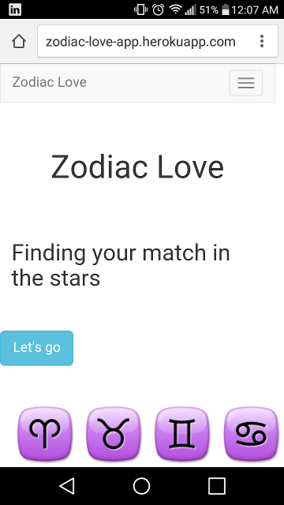
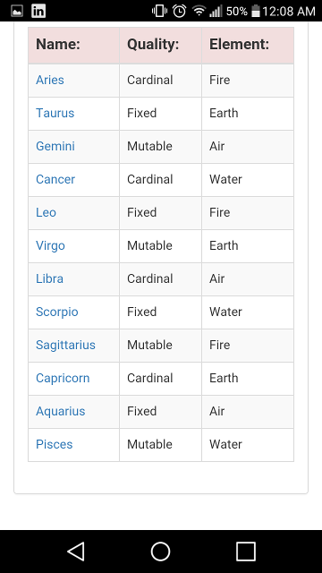
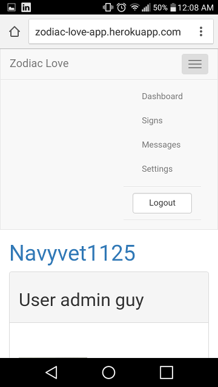
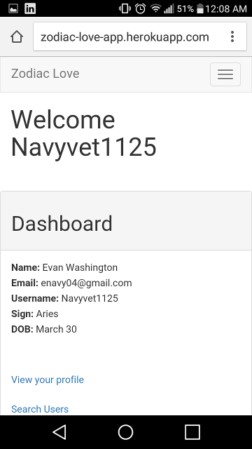

# Zodiac_Love
A dating site where finding someone is based on one's zodiac sign.  <a href="http://zodiac-love-app.herokuapp.com" target="_blank">Let's Go!!!</a>

<a href="https://trello.com/b/1Z1dSTcs/zodiac-love" target="_blank">My Trello</a>

### Technologies
+ Built using Ruby on Rails
+ Utilizes Bootstrap
+ HTML, CSS
+ Heroku Web Server
+ Paperclip and AWS are used to archive files off site

### Requirements
+ Latest Version of Chrome, Firefox, IE, etc.
+ Bundle Install
+ An email address

### Installation Procedure
+ Fork the repo from GitHub
+ Clone the repo locally

#### In the terminal
+ Perform a Bundle Install to get all applicable Gems needed.
+ Perform rake db:create, rake db:migrate, and rake db:seed.
+ To view the app, perform rails s and visit localhost:3000 in your web browser

##The Zodiac Love Experience

### Landing Page
+ When first navigating to Zodiac Love, clients will be taken to a landing page.
+ Existing clients will be able to sign in from the landing page.
+ New clients will be prompted to sign up

### Sign Up
+ When a new client begins the sign up process, they are directed to a signup form.
+ Users will be prompted to submit a user name, email, and password, as well as their D.O.B, and location.

### Zodiac Archive
The Zodiac Archive is available to both members and non-members, and contains information about each of the individual signs of the traditional western zodiac.

### Other Features
+ Messaging between profiles
+ Search feature
+ User profiles
+ login/logout functionality
+ upload pictures with Paperclip and AWS
+ Full CRUD User experiece

### Excluded Features this version
+ Search enhancement to find people that match your preferences within a specified radius
+ Email notification